# One image in, a Gaussian splat out — what I learned building Image2Splat

*A research write-up and a recipe. Everything here ran on one consumer GPU, in a
Windows bedroom, between 3 August and 17 September 2026. It is written so you can
reproduce it by hand, or hand the whole thing to a coding agent and let it build the
tool for you. Or skip both: the tool is in this repository, and the
[README](../README.md) gets it running.*

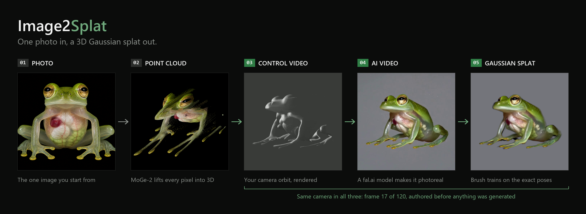

---

## TL;DR

- **The problem:** I make single images — designed typography, creatures, cutaway
  machines — and I wanted them as 3D Gaussian splats I could orbit, light and drop into
  motion work. No multi-view capture exists for a thing that only exists once.
- **The route that works:** author the camera orbit *first*, render a cheap "control
  video" of the image lifted into 3D, have a video model turn that into a photoreal
  turntable, then train a splat against the camera poses you already know. **The poses
  are exact by construction.** That one inversion is the whole trick.
- **Why not the obvious route:** running a structure-from-motion solver on an AI video
  does not work, and it is not a tuning problem. AI video is not rigid. The subject
  changes shape as it turns. COLMAP registered 2 of 97 frames.
- **What it costs:** one fal.ai video generation per orbit, a few minutes of local
  matting, and 5–20k steps of Brush training — 20k steps took six minutes on the 5070.
  Under an hour of wall clock for a first result.
- **What is still hard:** the video model's inconsistency shows up in the splat as
  black patches from certain angles. I measured it — it is spherical-harmonic
  overfitting, not geometry — and there are cheap mitigations, but no cure yet.
- **This will be replaced.** Direct image-to-3D generators are improving monthly. But
  today, for a *specific* image you designed and want reproduced faithfully rather than
  re-imagined, nothing is as straightforward as this.
- **Get it:** the tool is **Image2Splat**, MIT-licensed, in this repository. No model weights are
  hosted — each downloads from its own source on first use. Bring your own fal.ai key
  and a copy of Brush.

---

## Who this is for

You have a picture. Maybe you generated it, maybe you rendered it, maybe you drew it.
You want it as a 3D object that turns. You have a gaming GPU and a weekend.

You do not need to be a researcher. I am not one. Everything below was arrived at by
measuring things that looked wrong until they stopped looking wrong, and I have kept the
numbers in so you can tell which claims are load-bearing.

---

## Hardware and software

| | |
|---|---|
| GPU | NVIDIA RTX 5070, 12 GB VRAM (Blackwell, `sm_120`) |
| OS | Windows 10 |
| Python | 3.12, one `uv`-managed venv, **torch 2.8 + CUDA 12.9** |
| Splat trainer | [Brush](https://github.com/ArthurBrussee/brush) — a single `brush_app.exe`, no install |
| Video generation | [fal.ai](https://fal.ai) hosted endpoints (LTX 2.3, Wan 3.0, Wan 2.2 VACE, MiniMax H3) |
| Local models | MoGe-2 (metric depth and lens), BiRefNet-HR, SAM 2.1 and RMBG-1.4 (matting). GeoCalib (camera pitch/roll/FOV) until mid-September — see below for why it went |
| Auto-describe | a vision model through OpenRouter — gpt-4o-mini by default; Claude Sonnet 5 / Opus 5 cost ~11× more and are still under a cent |

One hard-won note on the GPU: **Blackwell cards need torch built for CUDA 12.8 or
later.** A repo pinning `torch==2.6.0+cu126` will install fine and then fail at the
first CUDA call with "no kernel image is available". Check `torch.cuda.get_arch_list()`
includes `sm_120` before you blame anything else.

---

## How it started, and the three dead ends

### August 5–6: an AI turntable video and a Blender rig

The first idea was the obvious one. Generate a 360° turntable video of a character
from a still, extract the frames, solve the camera path, train a splat.

The camera solve failed immediately and completely:

```
COLMAP 4.1.1, 97 frames, SIFT + exhaustive matching
Registered images: 2 of 97
Points: 210
```

**Structure-from-motion needs the same physical point to be visible across views.** An
AI video re-hallucinates the subject on every frame — wings change shape, drape refolds,
a candle moves. The matcher finds candidates; bundle adjustment finds no rigid
camera-plus-scene that explains them; everything is rejected. Better matchers
(LightGlue and friends) are documented in the literature as making no difference on
generated imagery. This is a **property of the data**, not of the solver.

So for the prototype I hand-keyed the camera in Blender to match the video, exported the
poses in COLMAP's text format, and trained. It produced a usable static splat in about
1h40m. It also established the single most important finding of the whole project:

> **The subject in an AI-generated turntable video is not rigid.** Every technique that
> assumes rigidity performs worse because of it.

Three more things were tried and rejected on the same footage, with numbers:

| Approach | Result | Why it failed |
|---|---|---|
| **Apple SHARP** (single-image → gaussians) | discarded | It predicts one gaussian per pixel at a predicted depth. A depth-lifted image, not a reconstruction. Falls apart the moment you orbit. |
| **AnySplat** (pose-free feed-forward) | 17.75 dB vs 20.71 dB for a *uniform circle guess* | Works internally at 448×448 — it saw 5% of my pixels. And its poses cost 3.8 dB when swapped in alone. |
| **gsplat `--pose_opt`** (let the optimiser move cameras) | −1.34 dB | It assumes the scene is rigid and the cameras are wrong. Here the cameras were right and the scene was non-rigid, so it absorbed drift into pose error and corrupted geometry that had been fine. |

And one that worked *too* well: **Deformable-3DGS** scored +8.4 dB over static 3DGS and
its renders were near-indistinguishable from ground truth — but only as a 4D model.
Every attempt to collapse it into one static splat failed. Better research result, worse
practical one.

### August 8–9: measuring poses instead of guessing them (Img2Gaus, alpha)

If hand-keying works, measuring should work better. I built a local web tool that
estimates the camera orbit from the footage itself — masks, depth, optical flow,
CoTracker point tracks, several solvers — and, more importantly, built a **ground
truth** to score them against: the same character rendered from Blender with the camera
path written straight out of the camera object.


| solver | angle RMS |
|---|---|
| CoTracker + circle bundle-adjust (mask only) | **3.84°** |
| normal Procrustes + DSINE normals | 3.90° |
| free 6-DoF bundle adjust | 13.35° — a noise sink; drifted the camera 57% of the orbit radius vertically when the truth was zero |

Then the experiment that changed the plan. Two Brush trainings, identical except for the
angle schedule:

```
solved poses (4.5° RMS)   25.06 dB
exact poses               29.58 dB      4.5° of pose error costs 4.5 dB
```

Every solver I had topped out around 4°. **Pose error was the dominant remaining term,
and no amount of solving was going to remove it.**

### August 22: lock the poses, generate the video to match (V3)

So stop solving. Render the orbit from a known camera in Blender, send *that* render to a
video model as a control signal, and have the model generate the photoreal turntable
*following the render*. The poses are then known exactly because you chose them.

Measured on the Aarushi dataset: the AI tracked the Blender render at **0.9042 mean
silhouette IoU**. The premise held in practice, not just in principle.

But it still needed a Blender scene, a hand-built rig, and a character that already
existed as a 3D model. The thing I actually wanted was to start from **one image**.

---

## The idea, stated once

```
                photo
                  │
    lift into 3D  │  depth model, lens measured from the photo
                  ▼
        point cloud on a "card"
                  │
   author orbit   │  radius, elevation, lens, canvas -- YOU choose these
                  ▼
          control video          <- cheap render of the cloud along the orbit
                  │
   video model    │  "make this photoreal, follow the motion exactly"
                  ▼
        AI turntable video
                  │
   matte + COLMAP │  poses = the orbit you authored. Exact. Not solved.
                  ▼
               Brush
                  ▼
           Gaussian splat
```

The video model is used for the one thing it is good at — inventing plausible
appearance from angles that were never photographed — and kept away from the one thing
it is bad at, which is geometric consistency. Geometry comes from the orbit you authored.

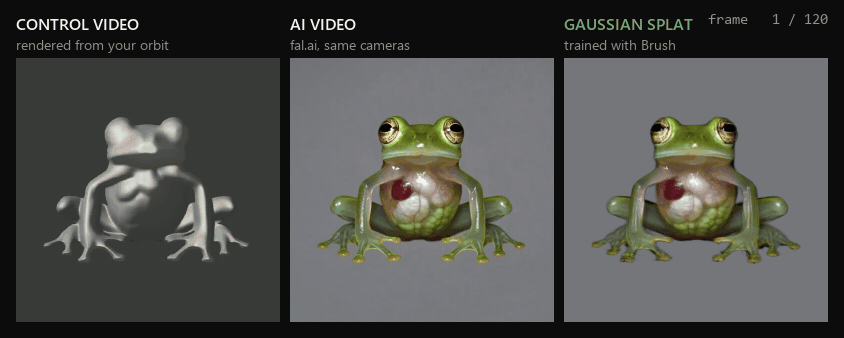

---

## The tool, generation by generation

### Img2Splat beta (late August – early September)

Six stages in one tab: Image → Cutout → Orbit → Generate → Review → Splat. Then more
tabs grew as problems turned up: a **retime** editor for clips whose frame count did not
match the poses, a **refine** tab wrapping SplatFormer, and a **passes** workspace that
loads the trained splat, orbits it from above and below, and sends *those* renders back
to the video model for a second and third ring of training views.

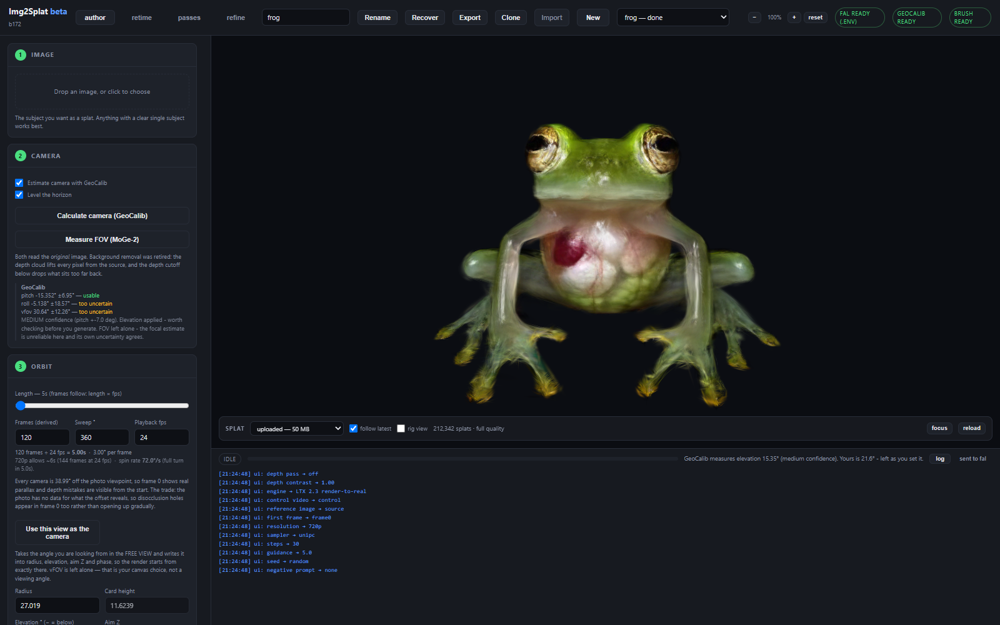

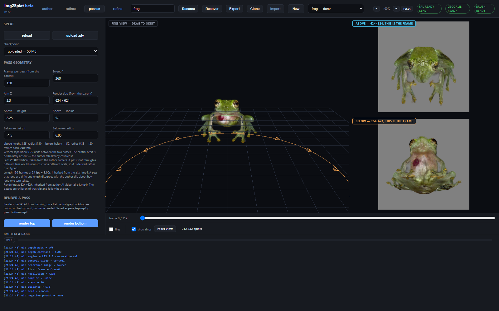

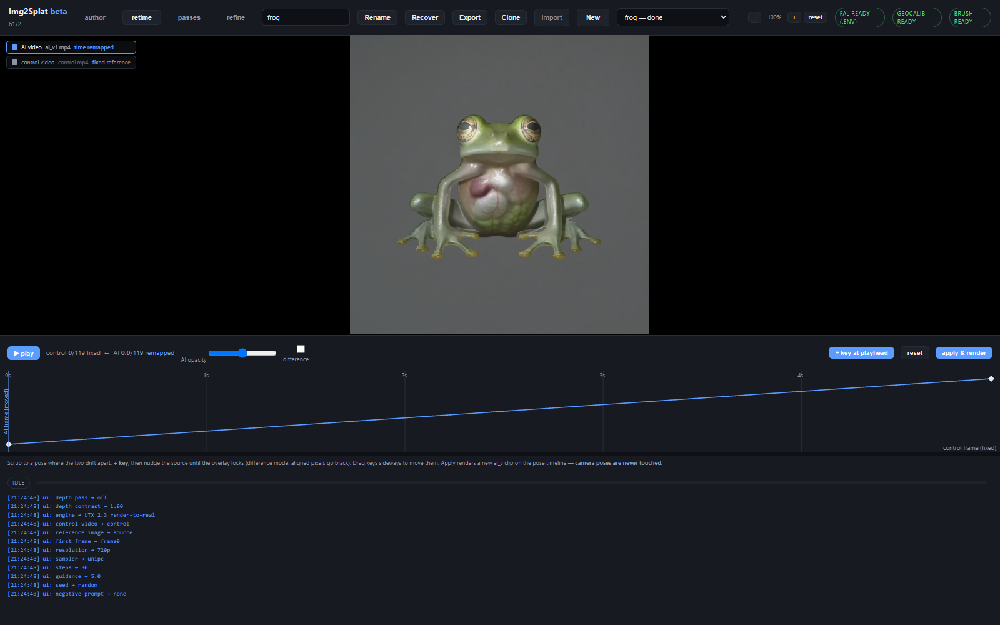

It worked. It was also 17,000 lines across seven files with ninety backup copies in the
web folder, and a UX review found things like two checkboxes at the top of step 2 that
were referenced by nothing at all.

### Img2Splat_beta (September)

Ported, not rewritten — the geometry code carries a lot of measured knowledge and I did
not want to lose any of it — into a package with routers, a design system that is just
greys plus one accent, and one rule that drove the whole rebuild:

> **If a condition should stop the user, it is a status row that disables the primary
> button.** A red sentence inside a paragraph is decoration.

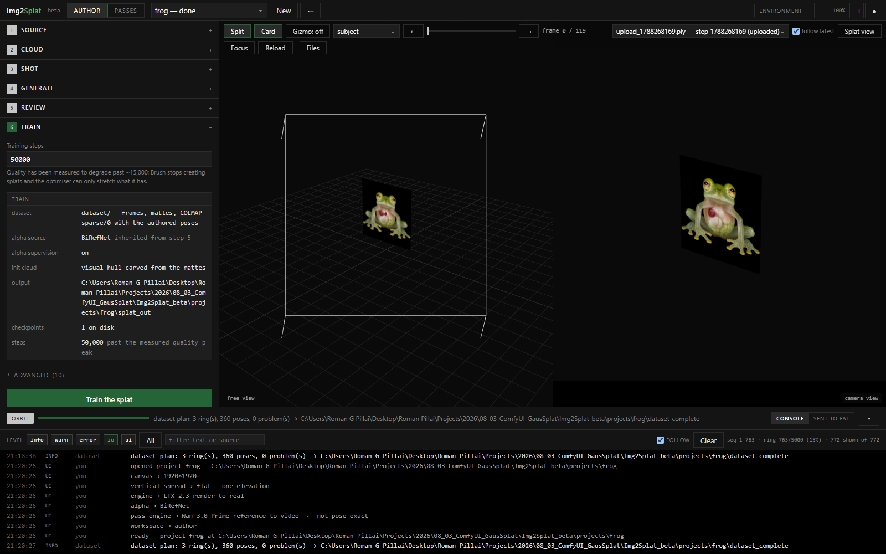

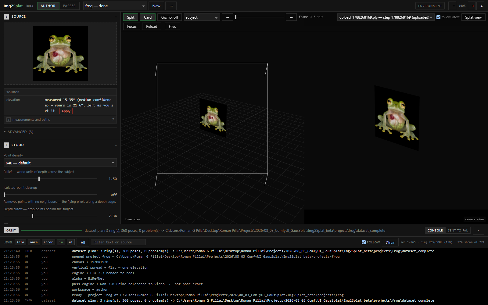

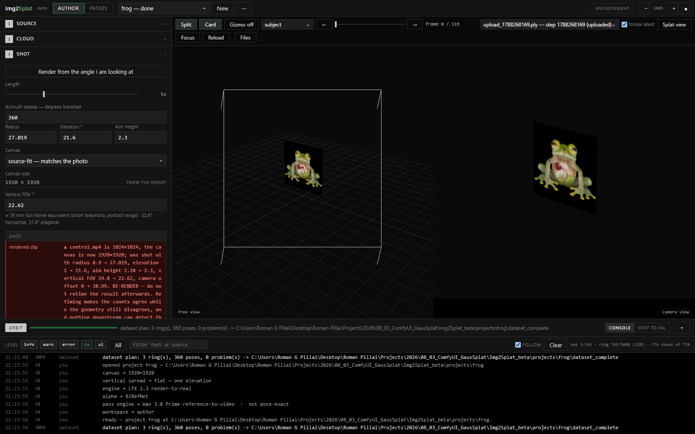

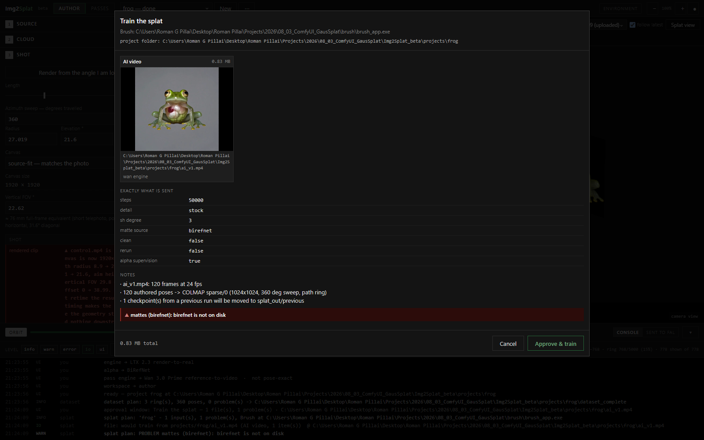

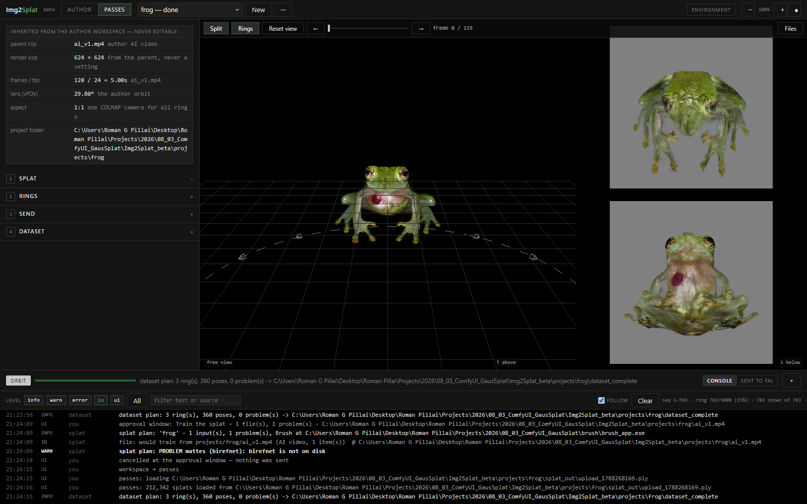

The console along the bottom is deliberately a headline feature. Every click logs. Every
file written or sent logs its full path. Every error is stamped so it cannot resurface
under an unrelated button later. When something goes wrong at 2am, "which file did that
actually use" is the only question that matters.

### Image2Splat (mid-September): the public release

Same code, a new name, and a round of cuts made by using it rather than by planning it.

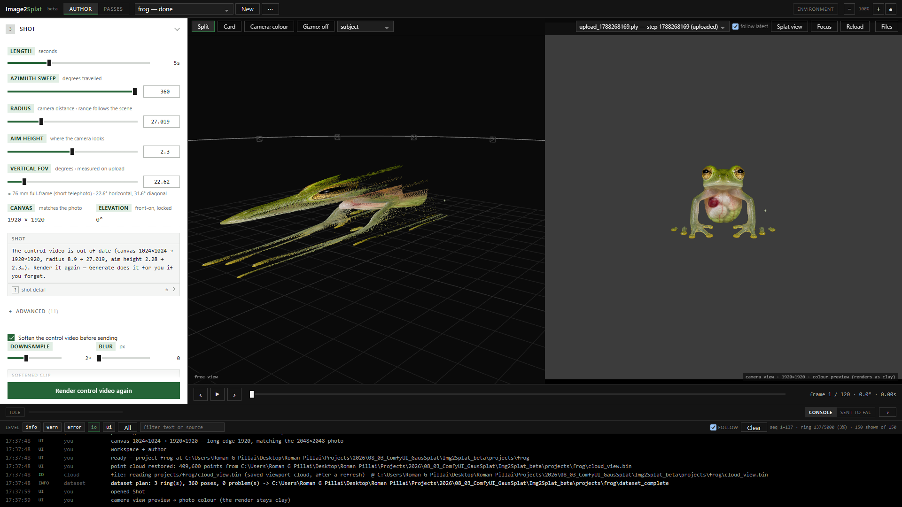

- **GeoCalib is gone.** The camera now sits at elevation 0, looking straight at the
  front, with a canvas at the photo's own aspect (long edge 1920). A camera that
  reproduces the photo head-on leaves pitch and roll with nothing to do. MoGe-2 was
  already measuring the field of view, so it runs on upload and seeds the lens. The
  Passes workspace still goes above and below — that is its whole job.
- **Flat clay.** The control render used to fake a Lambert shade from the depth slopes.
  Now every point is one grey, 150, against a backdrop of 60, far enough apart that the
  matte still has an edge to find. The trade is real: the video model gets the outline
  and the motion but no surface form inside it, and has to take that from the prompt
  and the reference photo. The camera pane can preview the photo colours; the render
  stays clay.
- **Every button answers.** A spinner and a verb while it works, then a tick or a cross.
  Server refusals arrive as a toast, and a value the tool changes for you blinks once.
- **The point cloud survives a refresh.** Every lift is saved in the project with the
  settings that made it and read back when the project opens. The MoGe-2 depth map is
  cached too, so re-lifting after a slider change no longer re-runs the model.
- **A playhead under the viewport**, full width, in both workspaces.
- **An independent review.** A second agent graded user flow, animation, ease of use and
  feedback. It went 6.5, then 8.0, then 8.5 out of 10 over three rounds, and each round's
  complaints were the to-do list for the next.
- **Packaged for other people.** Pinned requirements, the fal key in a `.env` file,
  every model downloaded from its own source on first use, MIT licence.

---

## What it makes

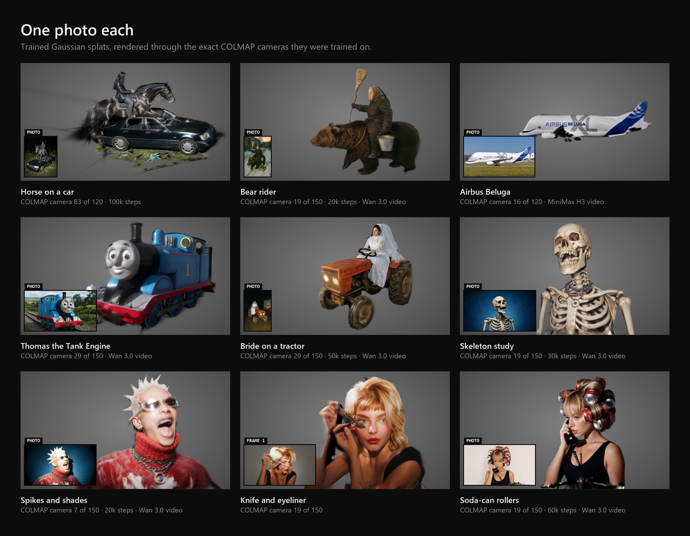

Every tile is the trained splat, rasterised with gsplat through a camera **taken
straight out of that subject's own COLMAP model** — rotation, position and focal length
as trained. The only liberty is the crop: the focal length is scaled and the principal
point shifted, which is exactly a crop of that camera's image and changes nothing about
where it stands. No flattering invented viewpoint. The insets are the photo each one
started from — except the knife, where the original photo was not kept and the inset is
frame 1 of the AI video.

The steps and engines vary because these were made over six weeks while the tool
changed underneath them. The spiky one was trained on 17 September with stock Brush
settings, 20,000 steps, from a dataset the tool had built three weeks earlier: the 5k
export landed after a minute, the 20k after six. Look at the soft edges and the dark
streaks trailing off the horse. That is the price of training on a video that does not
quite agree with itself, and most of the findings below are about it.

One subject all the way round, through all three stages:

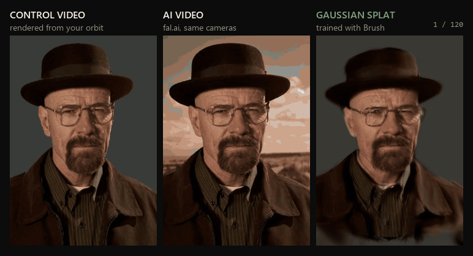

This one went through LTX 2.3, the pose-exact engine, and it shows: the splat holds the
face, the glasses and the hat brim through the whole turn. The clip itself opens on a
desert sky that fades to studio grey, and some frames come back letterboxed. The dataset
frames carry the matte as alpha, so neither reaches the splat.

---

## The models, honestly

Four video engines, all through fal. They differ in **one way that matters more than
quality**: whether returned frame *i* is authored pose *i*.

| engine | fal endpoint | pose-exact? | output fps | references | notes |
|---|---|---|---|---|---|
| **LTX 2.3 render-to-real** | `fal-ai/ltx-2.3-quality/render-to-real` | **yes** | honours what you send | 1 | Drives the render with your control video and takes an explicit frame count. The only engine whose output is *guaranteed* to line up with the poses. 720p ≈ 6 s max, 480p ≈ 15 s. |
| **Wan 2.2 VACE (depth)** | `fal-ai/wan-22-vace-fun-a14b/depth` | **yes** | honours | up to 8 | The control video drives every frame. 81–241 frames only. Also runnable locally in ComfyUI as a Q4 GGUF — both halves fit in 12 GB. |
| **Wan 3.0 Prime reference-to-video** | `alibaba/wan-3.0-prime/reference-to-video` | no | **fixed 30** | up to 10 | Treats the control video as a *reference*, not a driving signal, and exposes duration in whole seconds. Returns 150 frames at 30 fps for a 120-pose ring, whatever you ask. Looks great. Frame *i* is not pose *i*. |
| **MiniMax H3** | `minimax/h3/reference-to-video` | no | its own | up to 9 | The only one that returns 2K / 4K. Same caveat as Wan 3.0 — it chooses its own frame count. |

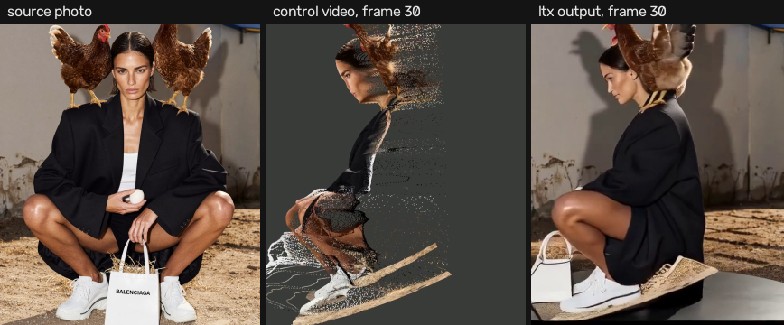

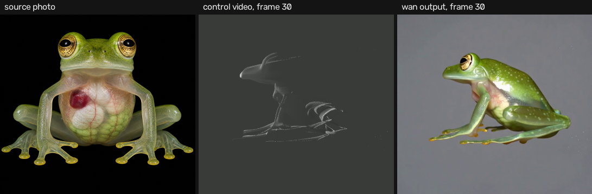

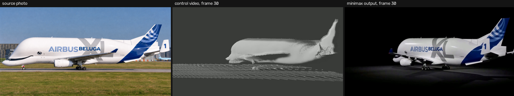

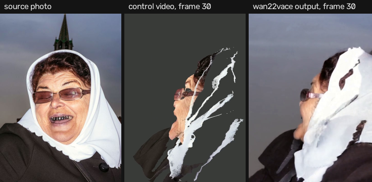

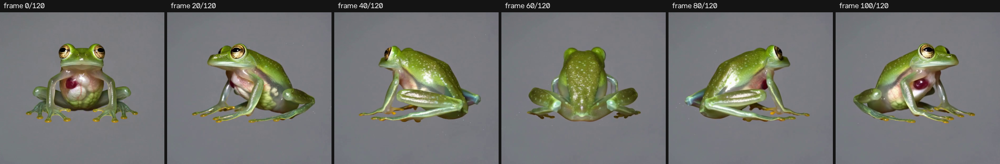

**What I would tell someone choosing:**

- Use **LTX or VACE** for anything that is going to be training data. Pose-exactness is
  worth more than resolution.
- Use **Wan 3.0 or MiniMax** when you want the prettiest turntable *to look at*, or as a
  reference-image supplier, and accept that a splat trained from them will be softer.
- "Retime to pose count" exists for the non-pose-exact engines. It resamples by uniform
  index. It makes the **count** agree while assuming the clip swept the path linearly in
  time. When that assumption is wrong, the geometry still disagrees and nothing
  downstream can detect it. It is a last resort, and the tool now says so.

**The frame-rate trap, specifically.** Wan 3.0 returns 30 fps. If your control video is
24 fps, you get 150 frames for 120 poses. The fix is not to retime the result — it is to
**re-render the control video at 30 fps** so you have 150 real poses. I lost a week to
this because the tool's own staleness check disabled the Render button while telling me
to re-render. Check that your tool cannot deadlock itself.

**Prompting.** The video model receives a fixed boilerplate with your description glued
on the end: `3DREAL photorealistic 360 degree turntable, lit by a single harsh direct
on-axis flash as the ONLY light source, …` then a long list of negatives (no scenery, no
sky, no soft lighting…). Two things matter: **lighting leads** — it used to sit at
clause 12 behind six negatives and did not survive into the output — and the tool shows
you the complete string, numbered by clause, before anything is sent. A video model
weights what comes first.

**Auto-describe.** A vision model looks at the source photo and writes the subject
description. Anything you typed yourself is passed back as a brief, and the server
subtracts its own previous caption first so a re-describe never feeds the model its own
words. Costs a fraction of a cent.

---

## The findings that cost the most to learn

### 1. Splat quality gets *worse* the longer you train

| checkpoint | splats | anisotropy |
|---|---|---|
| 5,000 | 127k | **5.8** |
| 15,000 | 483k | 84 |
| 30,000 | 485k | 990 |
| 45,000 | 485k | **1,212** |

Brush stops creating splats at `growth-stop-iter` (default 15,000). After that the
optimiser can only *stretch* what it has to cover the surface. Needles and holes are that
stretching. Keep the 5k and 15k exports. Do not default to 50k.

Also: **do not trust anisotropy as a proxy for quality.** Two runs with identical
settings came out 8.6× apart. The repo's own comment warns that chasing low anisotropy is
satisfied perfectly by fat blurry blobs. I optimised a metric for a week without checking
it against what I could see.

### 2. `opac-loss-weight 1e-6` destroys the init cloud

120k points to 3k, immediately. Use `1e-8` if you use it at all. This matters more once
the init cloud is a trained splat rather than a hull.

### 3. LPIPS is unusable in this Brush build on 12 GB

It requests a fixed 13.1 GB buffer regardless of resolution, frame count or splat count.
I proved that by shrinking all three at once. Not a tuning problem; do not retry.

### 4. The black patches are spherical harmonics, not geometry

The splat shows black regions that appear and disappear as you orbit. The obvious theory
— the video model generated the shape inconsistently and the optimiser could not decide
what was there — is half right. I evaluated every gaussian's spherical harmonics along
the actual training view directions:

```
frog_v3.ply: 284,454 gaussians, SH degree 3

black from SOME directions but not others :  22,679  (22.4%)   <- the artefact
black from EVERY direction                :     246  ( 0.2%)   <- real dark geometry
SH drives a colour channel NEGATIVE       :  50,563  (50.0%)   <- clamps to black
mean colour swing across view directions  :  0.522              <- should be ~0.1
```

At degree 3 each gaussian has 15 free view-dependent colour coefficients per channel.
When training views disagree, the cheapest way to reduce loss is not to find a compromise
colour — it is to say "it looks different from over there" and fit the disagreement
with those coefficients. They are unconstrained, so the fitted function goes negative in
directions that were weakly observed, and the renderer clamps to black.

And a representation fact that constrains every fix: **opacity in 3DGS is one scalar per
gaussian with no view dependence.** Colour is view-dependent; opacity is not. So "make
it transparent from the bad angles only" cannot be expressed. The fix has to be on the
colour side.

Cheapest lever: `--sh-degree 1`. Untested at the time of writing, but it removes exactly
the freedom being overfitted, and a flash-lit subject is close to diffuse anyway.

### 5. The literature on "views that disagree" is the right family, not a drop-in

NeRF-W gave every image its own appearance embedding. **RobustNeRF** (Sabour et al.,
CVPR 2023) reframed distractors as an outlier problem in the loss — trim the pixels
whose residual is much worse than the rest, with spatial smoothing so whole regions are
excluded together. **SpotLessSplats** carried that into 3DGS with semantic clustering
from diffusion features and pruning tied to how much a gaussian actually contributes.
WildGaussians, NeRF On-the-go, Splatfacto-W follow.

The honest catch: **all of them assume most of the image is consistent and a minority is
not.** A pedestrian crosses three of two hundred photos; the cathedral does not move. An
AI turntable drifts in *every* frame. There may be no clean inlier set to trim toward.
Directionally right, not directly applicable — and the part most likely to help is
NeRF-W's oldest idea, per-image appearance embeddings, which give each frame a legitimate
place to put its drift so the model stops abusing spherical harmonics for it.

*(Written from memory against a mid-2026 cutoff. Check venues and details before citing.)*

### 6. More views help — and they cost nothing to align

The trained splat lives in the author's COLMAP world. So a second ring above it and a
third below, rendered *from the splat*, are already in the same coordinate system. No
registration, no ICP, no pose solving. I verified this to floating-point noise:

```
all 360 camera centres agree — worst difference 9.45e-15 world units
```

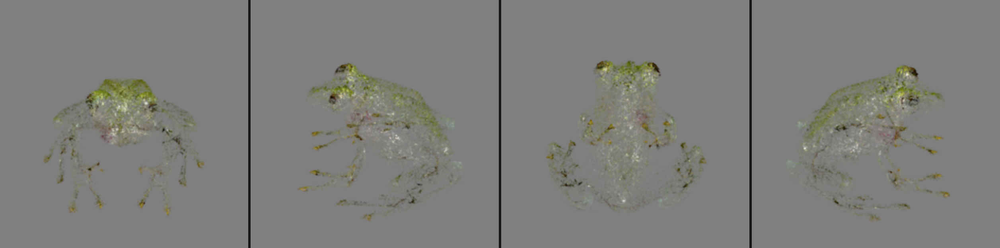

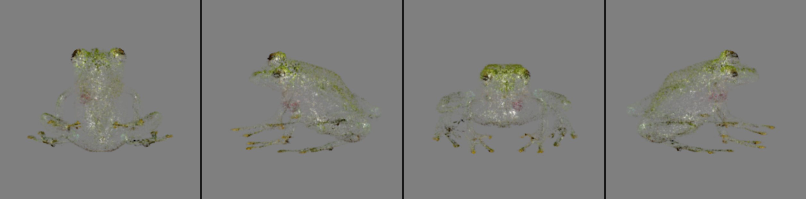

The one thing that does have to match is the **delivered size of every clip**, because
COLMAP describes a lens in pixels and focal length in pixels depends on the pixel grid
even when the lens is optically identical:

| delivered size | focal (px) — the same 29.8° lens |
|---|---|
| 624×624 | 1172.6 |
| 960×960 | 1804.0 |

Let the clips differ and each needs its own camera line. Keep them identical and one
camera describes all three rings. So the pass control render *inherits* the author AI
video's size, frame count and fps, the engine aspect is locked to match, and if a clip
comes back wrong anyway it is **resized, never cropped**:

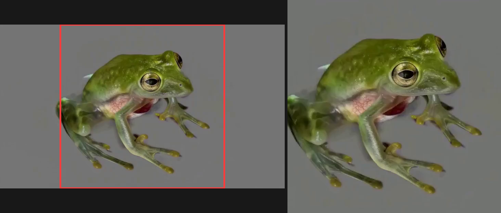

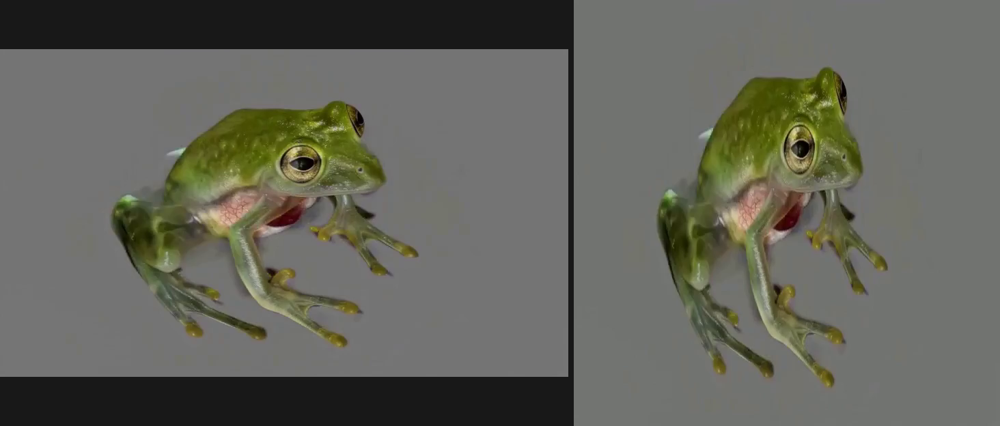

### 7. The camera has to be a camera

The photograph is unprojected onto a "card" in 3D. For a long time the card's height
was recomputed from the camera radius on every change — sized to exactly fill the
frustum. So moving the camera back made the card bigger by the same ratio, and the
subject subtended a constant angle. **The radius control did nothing, and it looked like
a rendering bug.**

The card is a fixed object in the world now, seeded once so frame 0 reproduces the
photo, then left alone. Verified by rendering at four radii and measuring the subject in
both the viewport and the output file:

| radius | subject width in the render | in the viewport |
|---|---|---|
| 8 | 94.4% | 94.5% |
| 12 | 63.0% | 63.1% |
| 17 | 44.4% | 44.5% |
| 30 | 25.1% | 25.3% |

Exactly 1/radius, agreement within two pixels of 1440. If your tool's preview and its
output ever disagree, measure both before trusting either.

### 8. Brush cannot resume from a PLY — but it can be seeded by one

Brush has `--start-iter` but no resume-from-checkpoint. It initialises from
`points3D.txt`. So to continue from an existing splat, write its gaussian centres into
`points3D.txt` as the init cloud. Positions and colour carry over; scale, opacity and
SH do not. That is how the three-ring dataset seeds from the one-ring result — 80,960
points from the trained PLY instead of a visual-hull carve.

---

## Recreate it

### By hand — the minimal path

1. **Environment.** Python 3.12, torch built for your CUDA (cu128+ on Blackwell),
   OpenCV, numpy, ffmpeg on PATH. Download `brush_app.exe`. Get a fal.ai key.
2. **Lift the photo.** Run a metric depth model (MoGe-2) on the image. It also measures
   the field of view — use that as the starting lens, never as an override. Displace
   each pixel along its camera ray by the depth. That is your point cloud.
3. **Author the orbit.** Pick radius, aim height, vertical FOV, frame count and fps.
   Keep elevation at 0 and the canvas at the photo's aspect, so frame 0 reproduces the
   photo. Generate camera poses on a circle in COLMAP convention (+Z forward, +Y down).
   Frame 0 at −90° azimuth, looking at the aim point, world-up +Z.
4. **Render the control video** of the point cloud along that orbit: every point one
   flat grey (150), on a darker flat grey backdrop (60). Grey, not black — black and a
   dark subject are indistinguishable to a matte.
5. **Send to a pose-exact engine** (LTX 2.3 or Wan 2.2 VACE) with the control video,
   the source photo as the reference image, and the flash-lit turntable prompt. Ask for
   exactly the frame count you rendered.
6. **Check the return.** Same frame count? Same fps? Same aspect? If not, **re-render
   the control video to match the engine** and generate again. Do not retime.
7. **Matte** the AI frames (BiRefNet-HR or SAM 2.1 with a text prompt). Do not use the
   control render's coverage as a matte — it marks where *points* landed, not where the
   subject is, and swings from 88% to 16% of the frame across an orbit.
8. **Write the COLMAP text model.** One `PINHOLE` camera at the delivered size, with the
   focal length scaled by delivered/authored size. One image line per frame in pose
   order. Init points from a visual hull carved from the mattes.
9. **Train.** `brush_app.exe <dataset> --total-steps 15000 --sh-degree 1
   --export-every 5000`. Keep the 5k export. The tool itself defaults to stock Brush
   settings, because every tuned preset I built measured worse than stock side by side.
10. **Optional second round.** Load the splat, orbit it from above and below, render
    those as control videos *at the author AI video's exact size and fps*, send them
    through the same engine, and build one dataset with all three rings and the trained
    splat as the init cloud.

### With an agent — paste this

> Build me a local web tool that turns one photograph into a Gaussian splat. Python
> backend (FastAPI), plain JavaScript frontend with a three.js viewport. Pipeline:
> upload photo → MoGe-2 metric depth and field of view → lift pixels into a point cloud
> on a card → author a circular camera orbit (radius, aim height, vFOV, frames, fps;
> elevation 0 and a canvas at the photo's aspect, so frame 0 reproduces the photo) with
> the orbit poses generated in COLMAP convention → render a control video of the cloud
> along the orbit as flat grey clay on a darker grey backdrop → send control video
> + source photo + prompt to a fal.ai video endpoint (LTX 2.3 render-to-real, or Wan 2.2
> VACE) → verify the returned clip's frame count, fps and aspect match, and if not warn
> the user to RE-RENDER the control video rather than retime the result → matte the AI
> frames with BiRefNet → write a COLMAP text model with the authored poses and a visual
> hull as init points → launch Brush with `--total-steps 15000 --sh-degree 1`.
>
> Rules: the camera card must be a fixed object in world space, never rescaled from the
> radius. Every derived value (lens, canvas, frame count) must be shown with where it
> came from. Any condition that should stop the user must disable the primary button, not
> just print red text. Every button shows progress while it works and a tick or a cross
> when it ends. Save the lifted point cloud in the project so a refresh does not lose it.
> Show the exact prompt string and the full path of every file
> before anything is sent. Log every click and every file operation with its full path
> to a console in the UI. Add a second workspace that loads the trained splat, defines
> orbits above and below it, renders them as control videos inheriting the author clip's
> size and fps, sends them to fal, and builds one merged COLMAP dataset with one camera,
> seeding the init points from the trained splat.

That prompt describes what exists. An agent given it and this document will get most of
the way there in a session; the measured constants in this post are the parts it cannot
guess.

---

## What is still wrong, and what is next

- **The black patches.** Measured, understood, not yet fixed. `--sh-degree 1` is the
  first experiment; a per-gaussian SH repair pass on existing splats is the second; a
  trainer with per-image appearance embeddings is the real answer and it is not Brush.
- **Non-pose-exact engines produce the best-looking clips** and the worst training data.
  Wan 3.0 and MiniMax outputs are consistently prettier than LTX's. If a future engine
  is both pose-exact and that good, half of this document becomes unnecessary.
- **Video artefact repair.** [FixAnything](https://github.com/kvuong2711/fix-anything)
  repairs rendering artefacts in a video with a Wan 2.1 LoRA. Its published stack wants
  ~28 GB for the 14B model in bf16 and torch cu126, neither of which fits a 12 GB
  Blackwell card — but the *model class* runs here already as a Q4 GGUF in ComfyUI, so
  the LoRA may load over that. Untested.
- **The quality metrics are uncalibrated against human judgement.** The oldest open
  item. Name three good splats and three bad ones, check the numbers against them,
  and every training-setting decision stops being guesswork.
- **Direct image-to-3D will overtake this.** TRELLIS, Hunyuan3D, TripoSplat and their
  successors improve monthly. They *re-imagine* the object rather than reproduce it,
  which is fine for a generic chair and wrong for a piece of typography you designed. For
  faithfulness to a specific image, today, this pipeline is the straightforward route.
  I expect that sentence to be false within a year, and I am fine with that.

---

## Appendix: the numbers, in one place

| what | value | where measured |
|---|---|---|
| COLMAP SfM on AI video | 2 of 97 frames registered | prototype, Nisha |
| AnySplat vs uniform-circle guess | 17.75 vs 20.71 dB | prototype |
| gsplat pose optimisation | −1.34 dB | prototype |
| best pose solver on rigid footage | 3.84° RMS | Img2Gaus, blender_gt |
| cost of 4.5° pose error | 4.5 dB | paired Brush runs |
| AI tracking a Blender render | 0.9042 silhouette IoU | V3, Aarushi |
| pass cameras vs author orbit | 9.45e-15 world units | Img2Splat, frog |
| focal at 624 vs 960 px, same lens | 1172.6 vs 1804.0 px | Img2Splat, frog |
| 5k → 45k steps | anisotropy 5.8 → 1,212 | Img2Splat |
| view-dependent-black gaussians | 22.4% | frog_v3.ply, SH degree 3 |
| gaussians with a negative SH channel | 50.0% | same |
| subject size vs radius | exactly 1/radius, ±2 px of 1440 | Img2Splat_beta |
| softening floor fal refuses | 156×156 (4× on 624) | Img2Splat_beta |
| LPIPS buffer request | 13.1 GB fixed | Brush, this build |
| stock Brush, 20k steps, 150 frames at 832×480 | 5k export in ~1 min, 20k in ~6 min | Image2Splat, RTX 5070 |
| independent UI review, three rounds | 6.5 → 8.0 → 8.5 / 10 | Image2Splat |
| clay grey vs backdrop grey | 150 vs 60 (0–255) | Image2Splat |

---

*Tools: Brush by Arthur Brussee. fal.ai for hosting the video models. MoGe-2, BiRefNet,
SAM 2.1 and RMBG-1.4 for the local models; GeoCalib and CoTracker3 along the way. gsplat
for the gallery renders. The tool itself was built with an
AI coding agent in the loop for most of it — the measurements are mine, the arguing about
what they meant was shared.*
